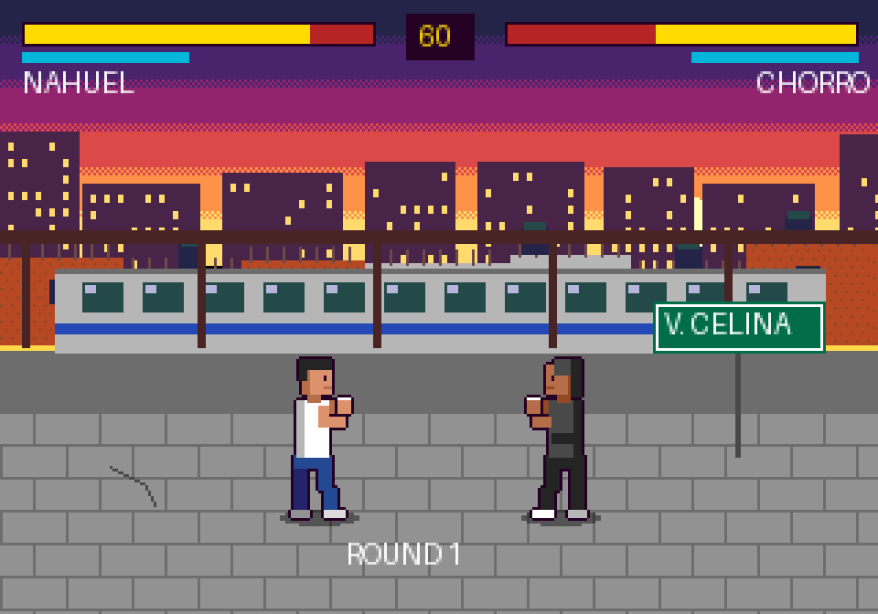

# Ynera Fighting (título provisorio: *Del Barrio al Octágono*)

Juego 2D en pixel art estilo 16 bits (Sega Genesis / Mega Drive).

Un pibe llega a **Villa Celina / Villa Madero** (La Matanza, Provincia de Buenos Aires). Apenas se baja del tren lo roban y lo cagan a trompadas. Entonces empieza a entrenar en un gimnasio del barrio, va eligiendo qué ejercicios hacer para subir sus stats y pelea contra rivales cada vez más difíciles, hasta llegar a la liga más grande de MMA del mundo, la **UCF** (liga ficticia).

- **Gestión:** semanas de entrenamiento en las que elegís actividades que suben stats.
- **Acción:** peleas arcade en 2D, de perfil, con piñas, patadas y especiales que se desbloquean. Sin lucha en el piso.
- **Recorrido:** peleas locales, después circuito continental de segunda línea y, por último, la UCF.
- **Protagonista:** el nombre lo elige cada jugador.
- **Tono:** barrio con corazón. Hay peligro, pero también entrenadores, vecinos y amigos que te bancan.

## Documentación

- [`docs/GDD.md`](docs/GDD.md): documento de diseño (historia, mecánicas, stats, peleas, poderes, etapas).
- [`docs/ROADMAP.md`](docs/ROADMAP.md): fases del proyecto y tareas del primer prototipo.



## Stack (todo gratis)

- **Motor:** [Phaser 3](https://phaser.io/) + TypeScript + Vite. Corre en el navegador y se comparte con un link.
- **Arte:** generado por código con Python + Pillow (`tools/art/`), con la paleta de 9 bits del Genesis.
- **Publicación:** GitHub Pages.

Para regenerar el arte:

```bash
pip install pillow
python3 tools/art/mockup_estacion.py
```

> Estado: pre-producción. Hay GDD y un primer mockup de arte; todavía no hay código del juego.
